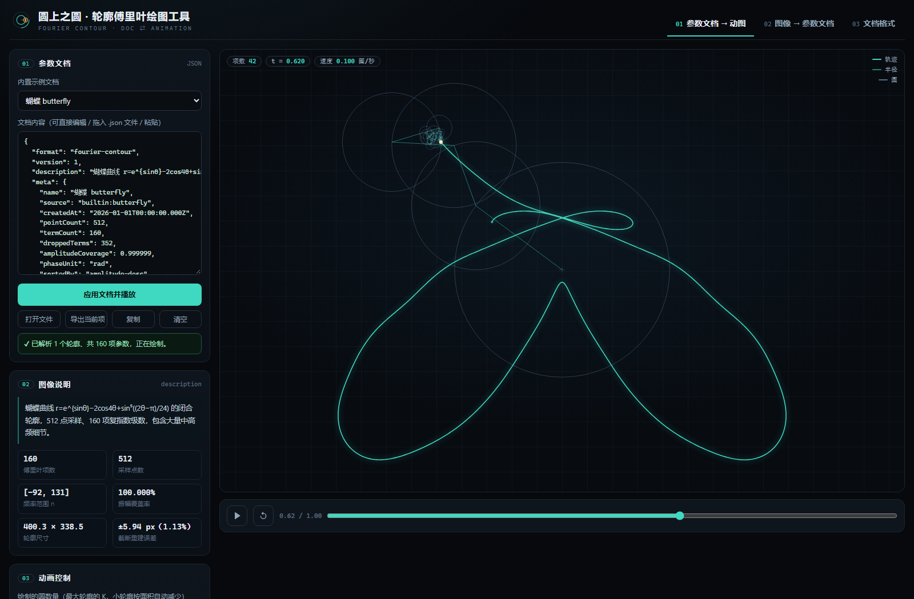
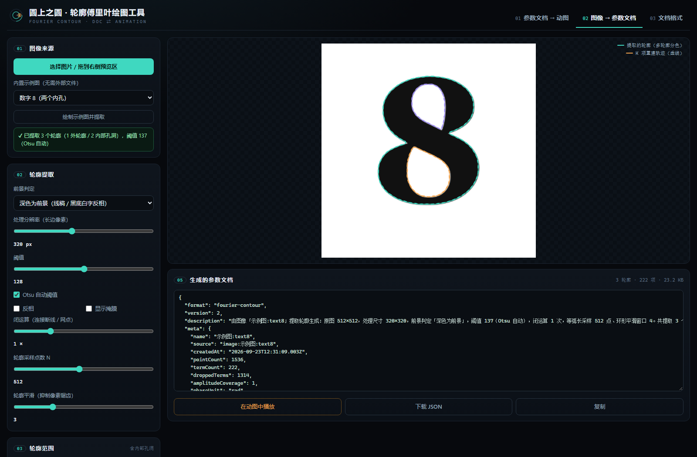
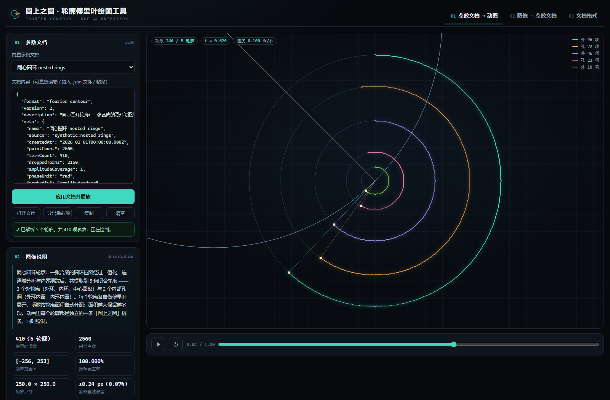

# 圆上之圆 · 轮廓傅里叶绘图工具

一个纯前端的双向工具：

- **参数文档 → 动图**：传入描述轮廓傅里叶系数的 JSON 参数文档，播放经典的「圆上之圆」动画，笔尖一笔画出整条轮廓（多轮廓时多条链条同时作画）。
- **图像 → 参数文档**：传入图片，自动提取**全部轮廓**（外轮廓 + 图像内部的孔洞），做傅里叶展开，导出一份可读、可编辑、可版本管理的参数文档。

速度可调（0.5 s – 60 s 一圈，或 0.5×–20× 预设），画布支持**滚轮缩放 / 拖动平移 / 双击复位**，
也支持空格、↑↓、←→ 快捷键。

零依赖、零构建、零后端：双击 `index.html` 即可使用。







> 第二张是数字「8」的提取结果：1 个外轮廓 + 2 个内部孔洞，三条轮廓分色叠加。
> 第三张是多轮廓动画：同心圆环的 5 条轮廓同时作画。

```
fourier-contour/
├─ index.html                  ← 双击打开这个
├─ assets/
│  ├─ style.css
│  ├─ fourier-core.js          数学核心（DFT/FFT、重采样、轮廓提取、文档解析；浏览器 + Node 双用）
│  ├─ app.js                   界面逻辑（动画渲染、图像处理、交互）
│  └─ examples.js              内置示例文档（由 tools/gen-examples.mjs 生成）
├─ examples/                   示例参数文档（8 份，可直接拖进工具）
├─ docs/参数文档格式.md         参数文档格式规范
└─ tools/
   ├─ gen-examples.mjs         生成示例文档 + 核心库自检（44 项断言）
   └─ smoke-test.mjs           用最小 DOM 垫片在 Node 里跑通整个界面（30 项断言）
```

## 快速开始

1. 双击 `index.html`（Chrome / Edge / Firefox 均可）。
2. **视图一**：从「内置示例文档」里挑一个，拖动「绘制的圆数量」看低频圆搭形、高频圆补细节的过程。
   也可以把自己的 JSON 直接拖进文本框，或点「打开文件」。
3. **视图二**：点「选择图片」或把图片拖进预览区，或用「内置示例图」（不需要任何外部文件）。
   调好阈值后点「生成参数文档」，再点「在动图中播放」即可看到自己图片的圆上之圆。

> 直接用 `file://` 打开时，个别浏览器会阻止读取本地图片的像素（安全限制）。此时界面会给出提示：
> 要么用「内置示例图」，要么在该目录起一个静态服务（例如 `npx serve` 或 `python -m http.server`）再访问。

## 参数文档长什么样

完整规范见 [`docs/参数文档格式.md`](docs/参数文档格式.md)。最短的可用文档只有两项：

```json
{
  "format": "fourier-contour",
  "version": 1,
  "description": "最小示例：一个半径为 100、圆心在 (200, 150) 的圆。",
  "terms": [
    { "n": 0, "amp": 250, "phase": 0.6435011 },
    { "n": 1, "amp": 100, "phase": 1.5707963 }
  ]
}
```

约定：轮廓是复平面上的闭合曲线，`z(t) = Σ amp·e^{i(2π·n·t + phase)}`，`t∈[0,1)`。
每一项就是一个圆：**半径 `amp`、初相 `phase`、角速度 `2π·n`**（`n` 为整数、可为负，表示反向旋转）。

有内部孔洞或多个形状的图形，用多轮廓结构（version 2）——每条轮廓一组 `terms`：

```json
{
  "format": "fourier-contour",
  "version": 2,
  "description": "圆环：外圈半径 100、内孔半径 50。",
  "contours": [
    { "role": "outer", "name": "外轮廓",   "terms": [ { "n": 0, "amp": 250, "phase": 0.6435 }, { "n": 1, "amp": 100, "phase": 1.5708 } ] },
    { "role": "hole",  "name": "内部孔洞", "terms": [ { "n": 0, "amp": 250, "phase": 0.6435 }, { "n": 1, "amp": 50,  "phase": 1.5708 } ] }
  ]
}
```

`examples/` 里的示例（都已通过自检）：

| 文件 | 内容 | 轮廓 | 项数 |
| --- | --- | --- | --- |
| `minimal-circle.json` | 手写最小示例：一个圆 | 1 | 2 |
| `heart.json` | 心形参数方程 | 1 | 128 |
| `star.json` | 五角星（尖角需要大量高频项） | 1 | 160 |
| `rose.json` | 玫瑰线 r=cos5θ | 1 | 96 |
| `cardioid.json` | 心形线 r=1−cosθ | 1 | 96 |
| `butterfly.json` | 蝴蝶曲线 | 1 | 160 |
| `epitrochoid.json` | 外摆线（与圆上之圆同源） | 1 | 160 |
| `lemniscate.json` | 双纽线 | 1 | 96 |
| `nested-rings.json` | **同心圆环：3 个外轮廓 + 2 个内部孔洞** | **5** | 410 |

## 界面上的可调项

**视图一（文档 → 动图）**

- 绘制的圆数量：只画每个轮廓中振幅最大的前 K 项（多轮廓时小轮廓按 √面积比自动减少），
  并实时给出「与全部项的偏差」。
- 速度：一圈用时 0.5–60 s 滑块 + 0.5×/1×/2×/4×/8×/20× 预设 + ↑↓ 快捷键。
- **视图缩放**：画布上**滚轮缩放（以光标为中心，0.05×–12×）**、**按住拖动平移**、**双击或点「复位视图」按钮复位**；
  左侧「缩放」滑块为对数刻度，与滚轮双向同步，画布徽标实时显示当前倍率。
- 轨迹线宽、Y 轴翻转、按振幅排序、网格、完整轨迹幽灵线。
- 空格键播放/暂停，←→ 逐步前进后退；进度条可拖动定位到任意 `t`。
- 参数表可在多个轮廓之间切换；图例按轮廓分色。
- 「导出当前项」把当前屏幕上的项数另存为 JSON（便于精简文档体积）。

**视图二（图像 → 文档）**

- 前景判定：深色 / 浅色 / 透明通道；阈值可自动（Otsu）或手动，支持反相。
- 轮廓范围：**仅最大外轮廓**，或 **全部轮廓（外轮廓 + 内部孔洞）**；可设最小轮廓面积、最多轮廓数。
- 处理分辨率、闭运算次数、轮廓采样点数 N、轮廓平滑窗口。
- 保留项数 K，并实时显示轮廓数量、振幅覆盖率、重建最大偏差与 RMS 偏差。
- 预览区叠加显示：掩膜、提取的轮廓（多轮廓分色）、K 项重建轨迹（同色虚线）。

## 开发与自检

```bash
npm test              # 核心库自检 + 生成示例 + 界面冒烟测试
npm run examples      # 只重新生成 examples/*.json 与 assets/examples.js
npm run smoke         # 只跑界面冒烟测试
```

- `tools/gen-examples.mjs`：55 项断言，覆盖 FFT/朴素 DFT 一致性、全项重建精度（误差 ~1e-12）、
  项数增加误差单调下降、JSON 往返、中文键名与角度制容错、错误提示、图像轮廓提取（面积/包围盒/最大连通域）、
  多轮廓与内部孔洞提取（含 `includeHoles` / `minAreaRatio` / `maxContours`）、多轮廓文档构造与往返、
  Otsu 阈值与形态学闭运算，以及「圆链末端 = 笔尖位置」这类动画几何自洽性。
- `tools/smoke-test.mjs`：61 项断言，用最小 DOM 垫片在 Node 里真正执行 `assets/app.js`，
  静态校验 73 个元素 id、跑通「载入示例 → 解析 → 采样 → 渲染 → 调参 → 导出」、
  「示例图 → 提取轮廓 → 生成文档 → 送入动图」以及「同心圆环 → 5 条轮廓 → 多链条动画 → 分轮廓查看参数」
  三条完整链路、滚轮缩放与拖动平移（含「以光标为锚点缩放时锚点不漂移」的像素级校验），以及坏文档的报错路径。

## 实现要点

- **傅里叶变换**：N 为 2 的幂时走迭代基 2 FFT（`O(N log N)`），否则退化为朴素 DFT，两条路径结果一致（有断言覆盖）。
- **轨迹采样**：`samplePath` 用复数递推代替逐点三角函数，1440 点 × 512 项也能在每帧拖动时重算。
- **轮廓提取**：Otsu 自动阈值（取两类灰度均值的中点，避免严格双峰时切不开）→ 可选闭运算 →
  前景/背景双向连通域标注（不与边框相连的背景域即内部孔洞，并归属到相邻最多的前景域）→
  对每个前景域与孔洞域做 Moore 邻域边界跟踪（Jacob 停止准则）→ 按面积排序与过滤 →
  等弧长重采样 → Hann 窗环形平滑。
- **多轮廓动画**：每条轮廓一条独立的圆链，项数按 √面积比分配，配色循环使用 8 色调色板。
- **误差指标**：既报告「同参数化下的逐点误差」，也提供与参数化无关的曲线偏差（点到折线最短距离，双向取最大）。
